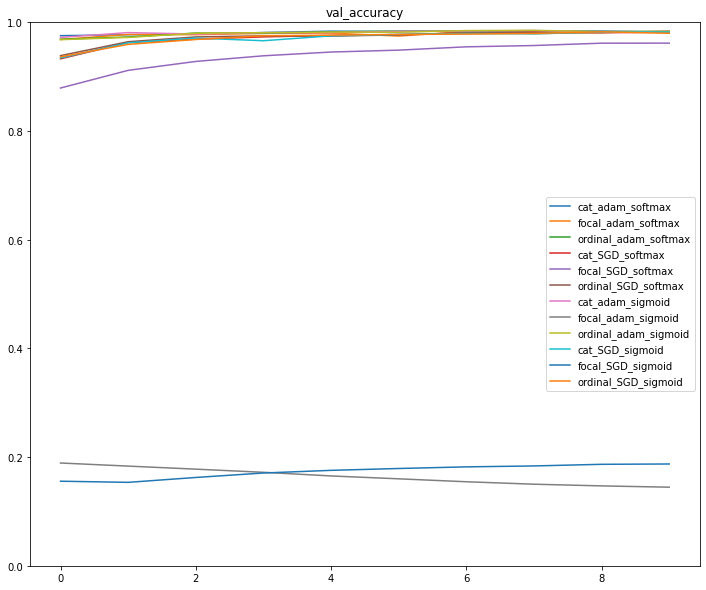
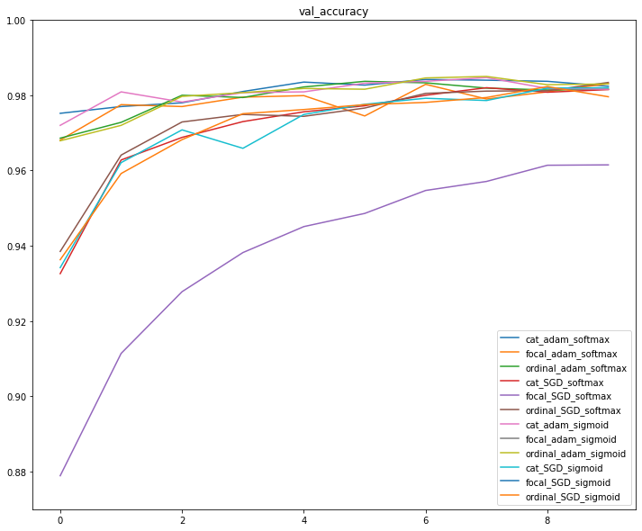
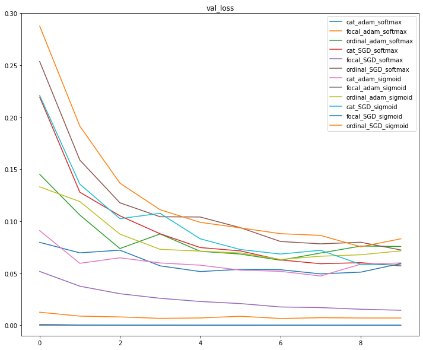
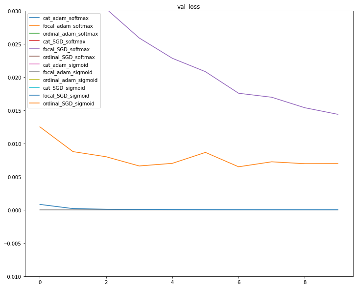

# mnist with different hyper parameters
In this repo, I trained a model on mnist data with different optimizers, loss functions and activation functions and make comparisons between results.

### val accuracy

### val accuracy zoomed

### val loss

### val loss zoomed
